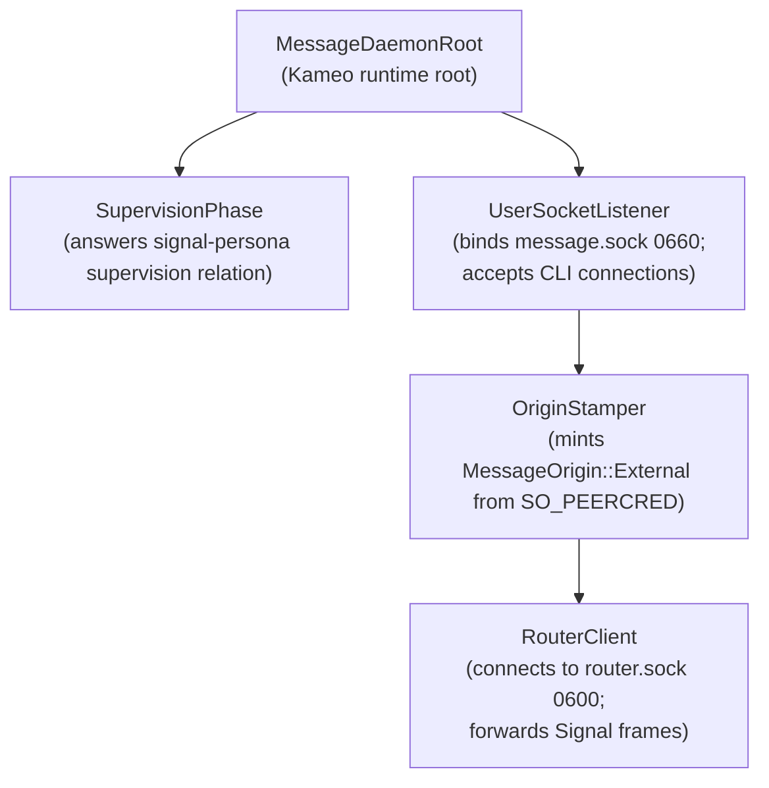

# persona-message — architecture

*Engine message ingress / text boundary. Owns the
`message` CLI and the `persona-message-daemon` supervised
first-stack daemon.*

`persona-message` owns two binaries:

- The `message` CLI — one NOTA in, one NOTA out. Validates a
  user-typed NOTA record through Rust types, projects to a
  `signal-persona-message` frame, sends it to
  `persona-message-daemon` on the engine's user-writable
  socket (`message.sock`, mode 0660), reads one reply frame,
  prints the NOTA reply.
- The `persona-message-daemon` — a small Kameo daemon
  supervised by `persona-daemon` as the engine's message
  ingress component. Binds `message.sock` at mode 0660 with
  the engine-owner group; mints
  `MessageOrigin::External(ConnectionClass)` from
  SO_PEERCRED on each connecting peer; forwards typed
  Signal frames to `persona-router`'s internal socket
  (`router.sock`, 0600) with the origin tag attached.

The word "proxy" in earlier framings of this repo was
descriptive ("proxy between CLI and router"), not a
component name. Per
`~/primary/reports/designer/142-supervision-in-signal-persona-no-message-proxy-daemon.md`,
the supervised first-stack component is named
`persona-message`; the long-lived binary is
`persona-message-daemon`; the "proxy" name retires from
type, binary, socket, and event vocabulary.

> **Scope.** Any "sema" reference in this doc means today's `sema`
> library (rename pending → `sema-db`). The eventual `Sema` is broader; today's
> persona-message is a realization step. See `~/primary/ESSENCE.md` §"Today and
> eventually".

---

## 0 · TL;DR

This repo owns the engine's message-ingress boundary: a
small supervised daemon plus a CLI client. Neither carries
a durable message ledger; both are stateless boundary
surfaces. Routing policy, delivery state, and channel
authority remain in `persona-router`.

```mermaid
flowchart LR
    "human or harness" -->|"one NOTA Send or Inbox"| "message CLI"
    "message CLI" -->|"length-prefixed signal-persona-message frame"| "persona-router"
    "persona-router" -->|"length-prefixed reply frame"| "message CLI"
    "message CLI" -->|"one NOTA reply"| "human or harness"
```

## 1 · Component Surface

`persona-message` exposes:

- a `message` binary;
- NOTA `Send` and `Inbox` input records;
- one length-prefixed `signal-persona-message` request frame per invocation;
- one NOTA reply projection per invocation;
- no caller-identity resolution and no local actor index.

## 1.5 · Daemon actor topology

Per
`~/primary/reports/designer/142-supervision-in-signal-persona-no-message-proxy-daemon.md` §3.3
and
`~/primary/reports/designer/143-prototype-readiness-gap-audit.md` §4.8:



Five actors, all data-bearing per `~/primary/skills/kameo.md`'s `Self IS
the actor` rule. The daemon is stateless across CLI requests — no redb, no
durable message ledger. It reads its `signal-persona::SpawnEnvelope` at
startup, binds `message.sock` at mode 0660 with the engine-owner group,
and proceeds.

The CLI surface (`message` binary) connects to `message.sock` like any
other client; the daemon's accept loop tags each connection's origin from
SO_PEERCRED before forwarding the typed `StampedMessageSubmission` to
`persona-router` over the internal `router.sock`.

## 2 · State and Ownership

The proxy owns no durable message state. It requires
`PERSONA_MESSAGE_ROUTER_SOCKET` and exits if the router socket is absent.

Caller identity is not resolved in this repo. `MessageSubmission` and
`InboxQuery` stay sender-free, and the proxy sends no in-band proof material.
Router/daemon ingress stamps provenance from the accepted socket context.

Actor registration, actor listing, pending delivery, retry, delivery results,
and message ledger state are router or engine-manager concerns, not proxy
state.

## 3 · Boundaries

This repo owns:

- NOTA parsing for the `message` command;
- projection from NOTA `Send` / `Inbox` to `signal-persona-message`;
- projection from `signal-persona-message` replies back to NOTA;
- length-prefixed Signal frame transport to the configured router socket.

This repo does not own:

- message or router contract definitions;
- final routing policy;
- durable database tables;
- actor registration writes;
- local message ledgers;
- terminal endpoint vocabulary;
- terminal byte transport;
- daemon runtime state.

## 4 · Invariants

- The CLI accepts exactly one NOTA input record.
- The CLI prints exactly one NOTA reply record.
- Supported input variants are `Send` and `Inbox`.
- The router socket is mandatory.
- Outbound traffic is a length-prefixed rkyv Signal frame.
- Sender identity is absent from the CLI payload and absent from frame auth.
- Provenance is stamped by router/daemon ingress, not by this proxy.
- The proxy does not write local message or pending logs.
- The proxy does not build or run a daemon.
- The proxy does not depend on an actor runtime.

## Code Map

```text
src/main.rs       message CLI entry
src/command.rs    NOTA input/output projection
src/router.rs     Signal router client
src/surface.rs    proxy-local NOTA surface records
src/error.rs      crate error enum
tests/            proxy and architectural-truth tests
```

## Constraint Tests

| Constraint | Test |
|---|---|
| The router Signal path cannot create a local message ledger. | `nix flake check .#message-cli-sends-router-signal-without-local-ledger` |
| Inbox reads come from the router, not a local ledger. | `nix flake check .#message-cli-inbox-uses-router-signal-not-local-ledger` |
| The router socket is mandatory. | `nix flake check .#message-cli-requires-router-socket` |
| The proxy does not construct in-band proof material. | `nix flake check .#message-proxy-cannot-own-local-ledger` |
| Retired terminal-brand vocabulary cannot return. | `nix flake check .#message-runtime-cannot-reference-retired-terminal-brand` |
| Local ledger, daemon, endpoint, and actor-runtime surfaces cannot return. | `nix flake check .#message-proxy-cannot-own-local-ledger` |

## See Also

- `../signal-persona-message/ARCHITECTURE.md`
- `../persona-router/ARCHITECTURE.md`
- `../signal-persona/ARCHITECTURE.md`
