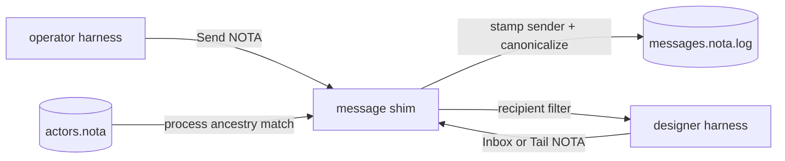

# Architecture

Persona Message is a contract repository. It does not own Persona's reducer,
harness lifecycle, authorization policy, or durable state engine. It owns the
message-plane records that those components agree on.

The prototype store is an append-only NOTA-line ledger plus a small agent config
file. It exists so harnesses can communicate immediately while the Persona
reducer is still being designed. The record shapes are the important artifact:

- `Message` is the durable unit of communication.
- `Agent` maps a harness name to a process ID for sender resolution.
- `Send` is the caller-facing input; the binary stamps the trusted sender.
- `Inbox` reads the current recipient view.
- `Tail` blocks and prints newly appended messages for the resolved recipient.

The later Persona daemon should replace the file ledger with the canonical
single reducer and transition log. BEADS should not become a compatibility
surface for this crate; BEADS is transitional coordination substrate.
